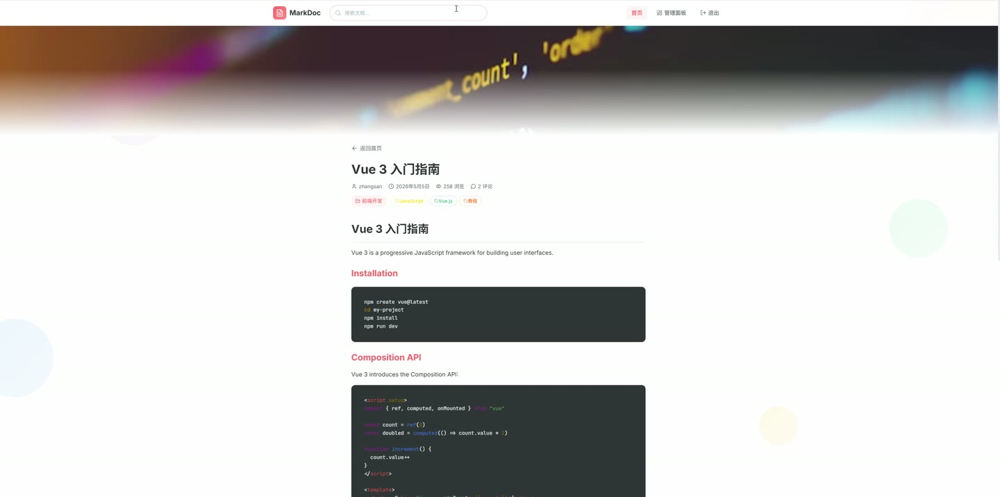
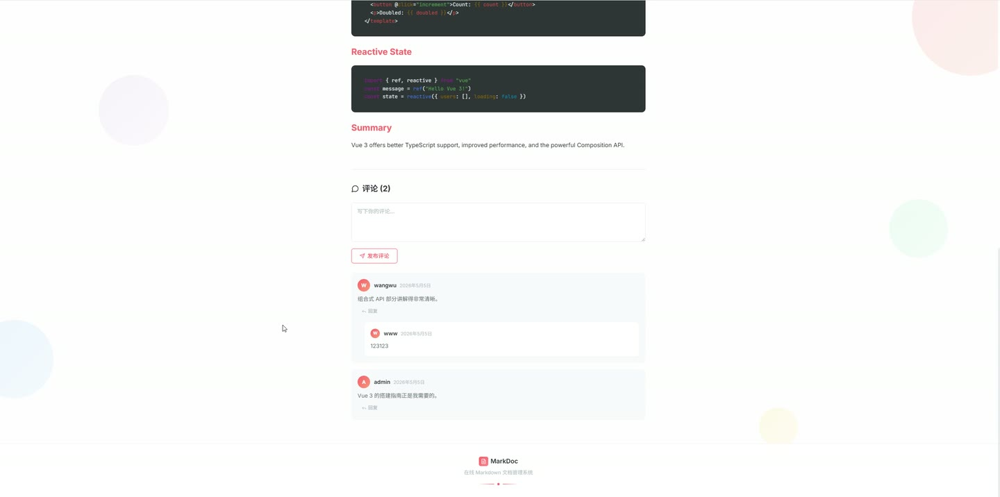
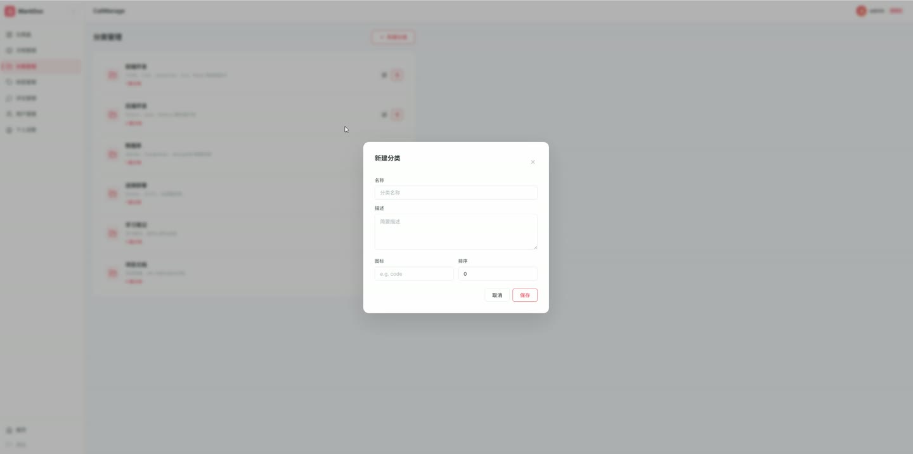
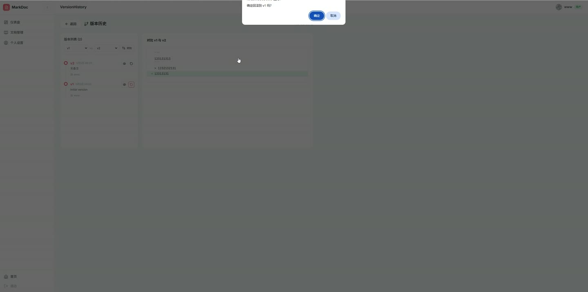

# (附文档)Python+Flask+Vue3 在线Markdown文档管理系统

**技术栈**：Python、Flask、Vue3、PostgreSQL

### 系统简介

本系统是一套基于 Flask + Vue3 的前后端分离在线 Markdown 文档管理系统，支持文档的编写、分类、标签、评论、版本追踪与公开浏览。系统内置普通用户与管理员两类角色，普通用户管理自己的文档，管理员可对全站分类、标签、评论与用户进行统一管理。
 
### 核心功能
 
### 普通用户端

 
- 注册账号：填写用户名、邮箱、密码与确认密码，校验两次密码一致后创建账号并自动登录。 
- 登录系统：输入用户名与密码登录，登录页提供管理员与普通用户两种快速登录入口。 
- 仪表盘概览：查看欢迎信息与最近文档列表，展示标题、发布状态、浏览量、更新时间。 
- 新建文档：进入编辑器填写标题、摘要、分类、状态、是否公开、封面图与标签后保存。 
- 编辑文档：加载已有文档内容回填表单，支持修改标题、摘要、正文、分类、标签与公开状态。 
- Markdown 编辑：提供标题、加粗、斜体、删除线、行内代码、代码块、列表、引用、链接、图片、表格、分割线工具栏按钮，支持 Tab 缩进。 
- 实时预览：一键切换编辑与预览模式，使用 marked 渲染 Markdown 并配合 highlight.js 高亮代码。 
- 图片上传：支持上传封面图与在正文中插入图片，上传后自动回填图片地址。 
- 标签选择：在编辑器中点选标签，选中标签按颜色高亮显示。 
- 文档管理：分页查看自己的文档列表，展示分类、状态、浏览量、更新时间，支持查看、编辑、删除。 
- 版本历史：查看指定文档的历史版本记录，包含版本号、变更说明、编辑人与时间。 
- 评论管理：按文档查看评论与回复列表，可删除自己文档下的评论。 
- 个人设置：修改邮箱、个人简介，上传头像并保存个人资料。 
- 公开浏览：在首页浏览公开文档，按分类查看文档列表，进入文档详情页阅读并发表评论与回复。 
- 搜索文档：通过搜索页按关键词检索文档并查看结果列表。
 
### 管理员端

 
- 数据统计：在仪表盘查看文档数、用户数、分类数、评论数、总浏览量、已发布数等统计卡片。 
- 全站文档管理：查看全部用户的文档列表，支持查看、编辑、删除任意文档。 
- 分类管理：新建、编辑、删除分类，填写名称、描述、图标与排序值，展示每个分类下的文档数量。 
- 标签管理：新建、编辑、删除标签，设置标签名称与颜色，提供颜色选择器与预设色板。 
- 评论管理：按文档查看全站评论与回复，支持删除任意评论。 
- 用户管理：查看用户列表并对用户进行管理操作。 
- 权限控制：路由守卫限制仅管理员可访问分类、标签、评论、用户管理页面。
 
### 技术栈

 后端框架Python + Flask ORMFlask-SQLAlchemy 登录认证Flask-Login（UserMixin） 数据库PostgreSQL 前端框架Vue3（Composition API + script setup） 状态管理Pinia（user store） 路由Vue Router（含路由守卫与权限校验） 构建工具Vite Markdown 渲染marked + marked-highlight + highlight.js 图标库lucide-vue-next
 
### 交付内容

 
- 后端完整源码 
- 前端完整源码 
- 数据库初始化脚本 
- 万字文档

## 界面展示

---

## 获取完整源码 + 万字文档

本仓库为项目介绍页。**完整前后端源码、数据库初始化脚本、万字项目文档**，请加微信 `kangkangcode`，或访问 [codekk.top](http://codekk.top) 获取。

可作课程设计 / 毕业设计参考，支持远程部署调试。